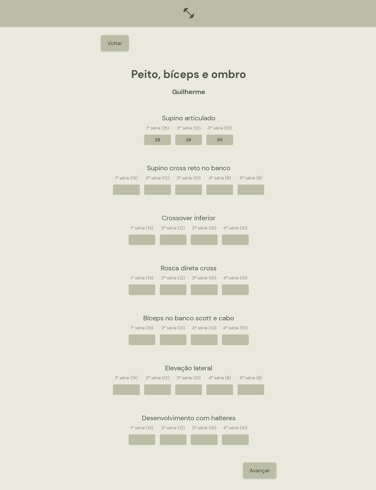

# Performance Note  

> Aplicativo pessoal criado para armazenar e utilizar durante treinos de musculação

### Ajustes e melhorias

Projeto concluído!

- [x] Desenvolvimento de todo o projeto em SPA utilizando React 
- [x] Páginas responsivas
- [x] Consumo de JSON local

## 💻 Pré-requisitos

Antes de começar, verifique se você atendeu aos seguintes requisitos:

* Você instalou a versão mais recente de `Node.js`.

## 🚀 Instalando Performance Note 

Para instalar o Performance Note, siga estas etapas:

* Clone esse repositório com `git clone https://github.com/gguilhermelopes/performance-note-app`
* Entre na pasta com `cd performance-note-app`
* Instale as dependências com `npm install`

## ☕ Usando Performance Note 

Para usar Performance Note, siga estas etapas:

* Certifique-se de que todas as dependências foram instaladas e que esteja na pasta do projeto. Utilize `npm start`
